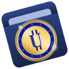
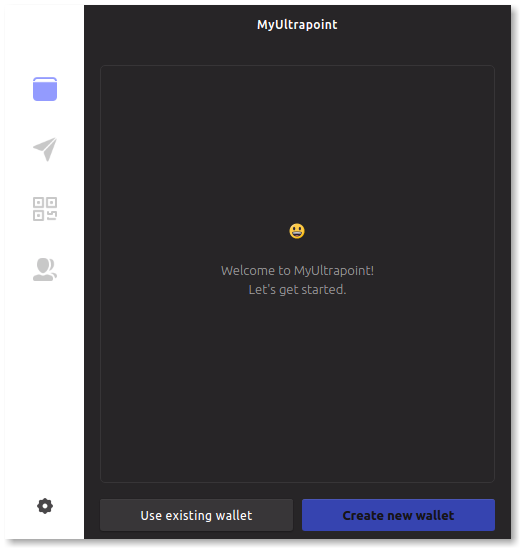

# MyUltrapoint from MyMonero JS - Desktop, Android, and Browser (Javascript)

### Info

1. License and Copyrights
2. What's in This Repo?
3. What is MyUltrapoint?
4. Features
5. Downloads
6. Requirements & Install Locations
7. Reporting Bugs & Making Feature Requests
8. Related Documents

### Contributing and Testing

1. Getting the Source Code
2. Repository Contents
3. Building for Production
4. Running in Development Mode
5. Contributing
6. Main Contributors

## License and Copyrights

See `LICENSE.txt` for license.

All source code copyright 
© 2017-2018 by MyUltrapoint
© 2014-2017 by MyMonero. All rights reserved.

## What's in This Repo?

This repository holds the Javascript source for the official [MyUltrapoint](http://www.ultrapoint.org/downloads.html), **desktop** and **Android** (Cordova) apps, plus the new MyUltrapoint **web wallet**.

## What is MyUltrapoint?

MyUltrapoint is a simple and featureful way to use the next-generation private digital currency called [Ultrapoint](http://www.ultrapoint.org). The MyUltrapoint app lets you manage your Monero wallets, address book, and transactions by storing your information locally and keeping it encrypted. 

MyUltrapoint is currently available for:

* desktop on Mac, Windows, and Linux; and
* mobile on Android.

The main reasons people use MyUltrapoint are its convenience and featurefulness. To accomplish this convenience and other features of MyUltrapoint, there's the privacy trade-off of sharing your private Ultrapoint "view key" with the MyUltrapoint server, so that it can scan the network for your wallets' transactions on your behalf. But it's impossible for MyUltrapoint to spend any of your funds or otherwise access your metadata, because your "private spend key" and "private wallet mnemonic/seed" are never sent to our server. So MyUltrapoint is often described as a 'non-custodial' service. In fact, in the near future, even the above trade-off will be eliminated as we're presently working to open-source a version of the back-end, which anybody can run as their own server at home.

## Features

* Multiple wallets at a time

* Contacts address book

* Deep OpenAlias integration (use domain or email instead of long Ultrapoint address)

* Creation of QR codes and messages to request Ultrapoint be sent to you

* Sending money to contacts, OpenAlias, or other Ultrapoint addresses (these may be input manually, or automatically by either dropping a request QR code on the Send screen or clicking a `ultrapoint:…` request URL on MacOS or Windows)

* Settings (for clearing data, managing preferences such as idle timeout, etc.)

* Strong (AES256) encryption to password protect all sensitive user data 

* Improved UX, including informative tooltips

## Downloads

Download the latest version from our website at [ultrapoint.org/downloads.html](http://www.ultrapoint.org/downloads.html) or from the Releases tab. *(Coming soon)* 

Developers and pre-release testers who would like to use and work on the app can run it by obtaining the source and running one of the build commands below.

To get set up with the source code, please see **Getting the Source Code** below.

## Requirements & Install Locations

The desktop app is built on [Electron](https://electron.atom.io) and can be packaged to run on modern versions of:

* MacOS (.app)
* Windows (installer .exe)
* Linux (.appimage)

The present implementation of the Android app is built on [Apache Cordova](https://cordova.apache.org). Native Android app in-progress.

**Note about Cordova version** Apache has recently released Cordova 7.0.0. It was tested, but because it now places plugins into package.json, npm cannot `update`, as a handful of those plugins do not have package.json files, and npm and yarn (based on current info) cannot install them as deps. So **6.5.0** is the Cordova version that MyUltrapoint currently supports for mobile builds, and it can be selected for use with `[sudo] npm install -g cordova@6.5.0`.

### User Data Locations

* Mac / Windows / Linux: via Electron's [`app.getPath('userData')`](https://github.com/electron/electron/blob/master/docs/api/app.md#appgetpathname)

* Android: via [`cordova.file.dataDirectory`](https://cordova.apache.org/docs/en/latest/reference/cordova-plugin-file/)

## Reporting Bugs & Making Feature Requests

If you would like to report an issue or share a feature request, please create a Github [Issue](https://github.com/ultrapoint/myultrapoint-app/issues) on this project.

If you're reporting a bug, be sure to include all information which we would need to reproduce the issue, such as the operating system and app version on which you saw the bug, and the steps you took, if you can tell. 

For customer support, you can also [contact](https://ultrapoint.org/#contact) us directly.

## Related Documents

* [Why We Built the Native Apps](./docs/WHY_NATIVE.md)

* [Technology Notes](./docs/TECHNOLOGY.md)

* Unofficial [Technology Roadmap](./docs/ROADMAP.md)

* [Packaging the App for Production Mode](./docs/PRODUCTION_BUILDS.md)

# Contributing & Testing

## Getting the Source Code

### Download & Install

1. First, ensure that you have recent versions of `node` and `npm` installed.

2. Clone or otherwise download this repository. Then, in your terminal, `cd` into the repo directory.

3. (To get the bleeding edge, and/or if you are going to make changes) Switch to the `develop` branch by executing `git checkout develop`.

4. **NEW** Be sure to set up and download all required Git submodules with `bin/update_submodules`. 

	* Note: At present, run this command after pulling this repo as necessary to keep all sub-modules up-to-date. 

5. Install all required `node_modules` by executing `npm install`.

#### On Debian/Ubuntu/Linux

* It has been reported that Debian/Ubuntu now calls the `node` binary `nodejs`. One workaround is to create a symlink from /usr/bin/nodejs to /usr/bin/node.

* libgconf is now a requirement for running Electron under Linux, and can be installed with `apt install libgconf-2-4` (https://github.com/electron/electron/issues/1518)

### Cordova

*If you are going to run the Cordova app under Android*

1. Install all Cordova development dependencies for Android. See [Cordova Installation Notes](./docs/CORDOVA_INSTALL.md) for details.

2. Run `bin/init_repo_for_cordova`.

## Repository Contents
* Executable scripts for common tasks are located in `bin/`

* Local, application source code is located in `local_modules/`. This includes bundled/static third-party "Vendor" libraries such as [EmojiOne](http://emojione.com).

* After installation, non-bundled third-party modules (such as Electron) will be located in `node_modules/`.

* App package and build process info is located in `package.json`.

* Cordova build configuration and dependencies are located in `config.xml`, `cordova_res/`, et al. Cordova build intermediate assets and stages are also located in `plugins/`, `platforms/`, and `www/`.

* This readme is located at `README.md`, and the license is located at `LICENSE.txt`.

## Building for Production

Unless you are a MyUltrapoint pre-release tester, you will not need to produce a production build of MyUltrapoint, especially because you want to be using a verified build of MyUltrapoint for daily usage. 

If you're testing a pre-release version of this app, you may want to build a production-ready version of the app rather than only running it in dev mode to verify its behavior in production mode.

See [Packaging the App for Production Mode](./docs/PRODUCTION_BUILDS.md) for information.

## Running in Development Mode

### Desktop

*Does not require you to package, sign, and install the app, and will cause the Developer window to be shown. Certain features, such as URL opening under MacOS, require production build.*

`bin/start_dev_desktop`

### Cordova

#### Android - Emulator

*Debugging is possible through Chrome; navigate to "chrome://inspect"*

`bin/start_dev_cordova_android_emu`

#### Android - Device

*Ensure that the USB Debugging is enabled and that the session is accepted on your Android device if you get `device.js` error. Also try removing the USB cable and replacing it. Navigate to "chrome://inspect" to monitor debug status. Also may help to run `adb logcat` while installing.*

`bin/start_dev_cordova_android_device`

### Browser (Web wallet)

`bin/start_dev_browser`

*Note:* If your system does not have the `open` command as is found on MacOS, then this command will fail at the last step to open `browser_build/index.html`. So after running the `start_dev` command, simply open `index.html` in your browser of choice.

## Contributing

### Testing

Please submit any bugs as Issues unless they have already been reported.

Suggestions and feedback are very welcome!

### Developing

If you have an improvement to the MyUltrapoint downloadable JS app and would like to have your code considered for usage in the production MyUltrapoint app, we'll be happy to review [pull requests](https://help.github.com/articles/about-pull-requests/). Contributors of merged PRs will be credited in the app's release notes.

Before contributing, please spend a few moments scanning the [technology notes](./docs/TECHNOLOGY.md) to learn about libraries used, reasons behind some architectural choices, and more.

* Merging PRs which involve integrating with any third-party services will require discussion and agreement.  

* We reserve the right to refuse to merge any PRs, such as those which introduce breaking changes.

The maintainer enjoys collaborating with volunteer contributors to the MyUltrapoint apps over IRC private message and the #myultrapoint room on freenode.net (Come say hello!), so PR'd submissions do not have to be at all complete or perfect on their first submission. (To submit a draft PR for review, simply mark it as '[DO NOT MERGE]')

For background on this project, see [Why We Built the Native Apps](./docs/WHY_NATIVE.md).

You may also like to read the unofficial [Technology Roadmap](./docs/ROADMAP.md) to get a peek at what we're thinking about for the future.

There's also an icebox of ideas, features, improvements, known issues, and other todos waiting to be knocked out which are kept in the [Issues](https://github.com/ultrapoint/myultrapoint-app/issues) tracker.

### Donating

The Ultrapoint donation address is: 9RUGwFu3WGh3wAkeWWzMNiQXiW9ChYRpH974mDdrGcjpEcpPrz143oc9sV1W8YyAUwCztbfxt9usZSMVnSBwPxCaDXzhYWz (viewkey: ac3b8aaffde0fba30a69cfceb54c7192aa6cf6161f86c8e970252d6ae94347e7)

The Bitcoin donation address is: 1DDquqzHZEM2PF7Qyftr9hvxk2NJaiozxx

The Monero donation address is: 42iXGr9Ms1FKxt1t8qLJdHRHVKvYMbgSxeRHNsNktjcpRypkEkPqjFT9Bses26xeZbPx5Qi7t5MPeKkzvvz4hYgdF8riCd5

Proceeds from donations are used to fund development on the MyUltrapoint back-end server (a performant version of which we soon™ plan to open-source for anyone to run their own server at home). Any remaining funds will go towards product (app UI) R&D, and hosting costs.

## Main Contributors

Contributors to each release are credited in release notes.

Checkout [MyUltrapoint contributors](https://github.com/ultrapoint/myultrapoint-app/graphs/contributors) and [MyMonero contributors](https://github.com/mymonero/mymonero-app-js/graphs/contributors)

### MyMonero Core

* 🏂 `endogenic` ([Paul Shapiro](https://github.com/paulshapiro)) Repo maintainer; Lead app developer; MyMonero partner

* 🦄 `fluffyponyza` ([Riccardo Spagni](https://github.com/fluffypony)) Advisor; MyMonero partner; Monero core team member

* 😎 `vtnerd` ([Lee Clagett](https://github.com/vtnerd)) Lead back-end developer

* 🍄 `luigi` Monero tech advisor; Main MyMonero JS core crypto contributor

* 🔥 `mds` ([Matt Smith](http://mds.is)) MVP designer

* 🌠 Your name here?

